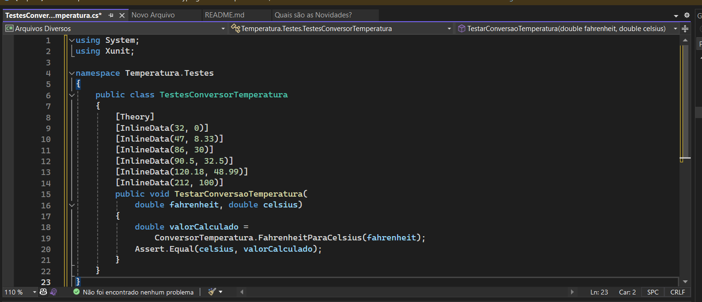
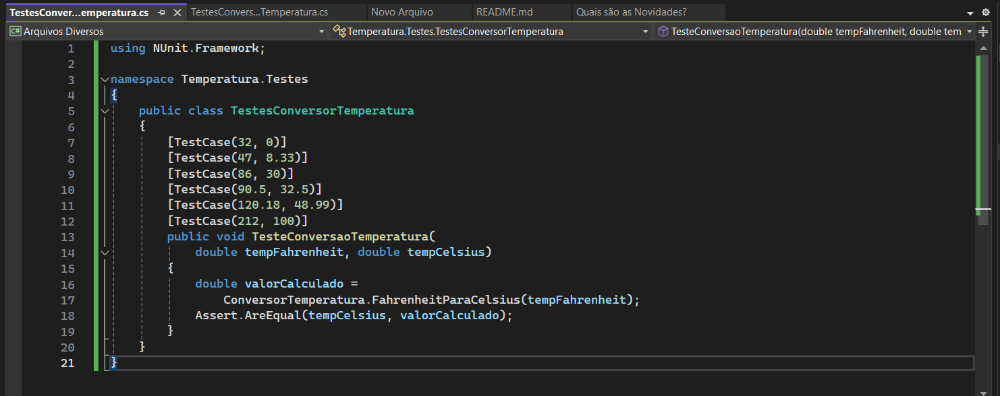

# AtividadeLiviaC-S6M10-IntegrationTests

Link tutorial: https://renatogroffe.medium.com/testes-de-software-com-net-5-exemplos-de-utiliza%C3%A7%C3%A3o-9b5514119ba2

Teste conex�o visual studio com github

## xUnit --> .NET 5 + Unit Testing + xUnit + Conversão de Temperaturas

O objetivo deste conjunto de testes é garantir que a função `ConversorTemperatura.FahrenheitParaCelsius` converta corretamente temperaturas de Fahrenheit para Celsius. Cada caso de teste fornece uma entrada de temperatura em Fahrenheit e verifica se o resultado da conversão corresponde ao valor esperado em Celsius. Isso ajuda a assegurar a precisão e a confiabilidade do método de conversão em diferentes cenários.

## NUnit --> .NET 5 + Unit Testing + NUnit + Conversão de Temperaturas

O objetivo deste conjunto de testes é assegurar que a função `ConversorTemperatura.FahrenheitParaCelsius` converte corretamente as temperaturas de Fahrenheit para Celsius. Cada caso de teste (`TestCase`) fornece uma temperatura de entrada em Fahrenheit e verifica se o resultado da conversão corresponde ao valor esperado em Celsius. Isso ajuda a garantir a precisão e a confiabilidade do método de conversão em diferentes cenários.

#### Diferenças e semelhanças com o código anterior (xUnit):

1. **Frameworks**:
   - O código anterior usava `xUnit` e este usa `NUnit`.
   - `xUnit` utiliza `[Theory]` e `[InlineData]` para fornecer dados de teste, enquanto `NUnit` usa `[TestCase]`.

2. **Estrutura dos testes**:
   - Ambos os códigos seguem uma estrutura similar para definir testes unitários.
   - Ambos verificam a exatidão do método de conversão `FahrenheitParaCelsius` utilizando diferentes conjuntos de dados.

3. **Assert**:
   - Em `xUnit`, a verificação é feita com `Assert.Equal`, enquanto em `NUnit`, a verificação é feita com `Assert.AreEqual`.

